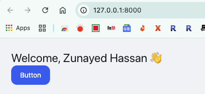

# Laravel 12 + Vite + InertiaJS + React + TailwindCSS 4 + Hero UI


## Project Setup

### Create a Laravel Project

```Shell
composer create-project laravel/laravel example-app
cd example-app
npm install
npm run build
composer run dev
```

### Setup Database

Create a new MySQL database. Here we have created a new database **called example-app-db**. Now open **.env** file and configure

```Plain Text
APP_URL=http://127.0.0.1:8000

DB_CONNECTION=mysql
DB_HOST=127.0.0.1
DB_PORT=3306
DB_DATABASE=example-app-db
DB_USERNAME=root
DB_PASSWORD=
```

Now migrate

```Shell
php artisan migrate
```

### Add AI (Optional)

```Shell
composer require laravel/boost --dev
php artisan boost:install
```

### Install InertiaJS

```Shell
composer require inertiajs/inertia-laravel
php artisan inertia:middleware
```

This will create **app/Http/Middleware/HandleInertiaRequests.php**.

Now, register the middleware in **bootstrap/app.php**:

```PHP
->withMiddleware(function (Middleware $middleware) {
    $middleware->web(append: [
        \App\Http\Middleware\HandleInertiaRequests::class,
    ]);
})
```

### Install InertiaJS React Dependency

```Shell
npm install @inertiajs/react
```

### Configure Vite

Open **resources/js/app.jsx** (for React):

Example for React (**resources/js/app.jsx**):

```JavaScript
//import './bootstrap';

import { createInertiaApp } from '@inertiajs/react';
import { createRoot } from 'react-dom/client';

createInertiaApp({
    resolve: name => {
        const pages = import.meta.glob('./Pages/**/*.jsx', { eager: true })
        return pages[`./Pages/${name}.jsx`]
    },
    setup({ el, App, props }) {
        createRoot(el).render(<App {...props} />)
    },
});
```

Install React DOM

```Shell
npm install react react-dom
```

Update **vite.config.js:**

```JavaScript
import { defineConfig } from 'vite';
import laravel from 'laravel-vite-plugin';
import tailwindcss from '@tailwindcss/vite';
import react from '@vitejs/plugin-react'

export default defineConfig({
    plugins: [
        laravel({
            input: ['resources/css/app.css', 'resources/js/app.jsx'],
            refresh: true,
        }),
        tailwindcss(),
        react(),
    ],
});
```


Install Vite Plugin for React

```Shell
npm i @vitejs/plugin-react
```

Make a page: **resources/js/Pages/Home.jsx**

```JSX
export default function Home({ user }) {
    return (
        <div className="p-6">
            <h1 className="text-2xl">Welcome, {user} 👋</h1>
        </div>
    )
}
```

### Create a Laravel Route

In **routes/web.php**:

```PHP
<?php

use Illuminate\Support\Facades\Route;
use Inertia\Inertia;

//Route::get('/', function () {
//    return view('welcome');
//});


Route::get('/', function () {
    return Inertia::render('Home', [
        'user' => "Zunayed Hassan",
    ]);
});
```


Open **resources/views/app.blade.php**

```PHP
<!DOCTYPE html>
<html lang="{{ str_replace('_', '-', app()->getLocale()) }}">
    <head>
        <meta charset="utf-8">
        <meta name="viewport" content="width=device-width, initial-scale=1">

        {{-- 👇 Vite preamble is required for React Refresh --}}
        @viteReactRefresh
        @vite('resources/js/app.jsx')

        @inertiaHead
    </head>
    <body class="antialiased">
        @inertia
    </body>
</html>
```

### Activate Tailwind CSS

Create a new file **tailwind.config.js**

```JavaScript
export default {
    content: [
        "./resources/views/**/*.blade.php",
        "./resources/js/**/*.jsx",
    ],
    theme: {
        extend: {},
    },
    plugins: [],
}
```

Open **app.blade.php** and update it

```PHP
<!DOCTYPE html>
<html lang="{{ str_replace('_', '-', app()->getLocale()) }}">
  <head>
      <meta charset="utf-8">
      <meta name="viewport" content="width=device-width, initial-scale=1">

      @viteReactRefresh
      @vite(['resources/css/app.css', 'resources/js/app.jsx'])

      @inertiaHead
  </head>
  <body class="antialiased bg-gray-100">
      @inertia
  </body>
</html>
```


### Add Hero UI

Install

```Shell
npm i @heroui/react framer-motion
```

At the **resources/css/hero.ts** file

```TypeScript
// hero.ts
import { heroui } from "@heroui/react";
export default heroui();
```

Open the **resources/css/app.css**

```CSS
@import 'tailwindcss';

@plugin './hero.ts';
/* Note: You may need to change the path to fit your project structure */
@source '../../node_modules/@heroui/theme/dist/**/*.{js,ts,jsx,tsx}';
@custom-variant dark (&:is(.dark *));

@source '../../vendor/laravel/framework/src/Illuminate/Pagination/resources/views/*.blade.php';
@source '../../storage/framework/views/*.php';
@source '../**/*.blade.php';
@source '../**/*.js';

@theme {
    --font-sans: 'Instrument Sans', ui-sans-serif, system-ui, sans-serif, 'Apple Color Emoji', 'Segoe UI Emoji',
        'Segoe UI Symbol', 'Noto Color Emoji';
}
```

#### Provider Setup

Open **resources/js/app.jsx** file

```JSX
//import './bootstrap';

import { createInertiaApp } from '@inertiajs/react';
import { createRoot } from 'react-dom/client';
import {HeroUIProvider} from '@heroui/react'
import React from 'react'

createInertiaApp({
    resolve: name => {
        const pages = import.meta.glob('./Pages/**/*.jsx', { eager: true })
        return pages[`./Pages/${name}.jsx`]
    },
    setup({ el, App, props }) {
        createRoot(el).render(
            <React.StrictMode>
                <HeroUIProvider>
                    <App {...props} />
                </HeroUIProvider>
            </React.StrictMode>
        )
    },
});
```

At the **resources/js/pages/Home.jsx** file

```JSX
import {Button} from "@heroui/react";

export default function Home({ user }) {
    return (
        <div className="p-6">
            <h1 className="text-2xl">Welcome, {user} 👋</h1>
            <Button color="primary">Button</Button>
        </div>
    )
}
```


Open **tailwind.config.js** again

```JavaScript
// tailwind.config.js
const { heroui } = require("@heroui/react");

export default {
    content: [
        "./resources/views/**/*.blade.php",
        "./resources/js/**/*.jsx",
        "./node_modules/@heroui/theme/dist/**/*.{js,ts,jsx,tsx}"
    ],
    theme: {
        extend: {},
    },
    darkMode: "class",
    plugins: [heroui()],
}
```

Open resources/js/app.jsx again

```JSX
// app.tsx or app.jsx
import './bootstrap';

import { createInertiaApp } from '@inertiajs/react';
import { resolvePageComponent } from 'laravel-vite-plugin/inertia-helpers';
import { createRoot } from 'react-dom/client';
import {HeroUIProvider} from "@heroui/react";

const appName = import.meta.env.VITE_APP_NAME || 'Laravel';

createInertiaApp({
    title: (title) => `${title} - ${appName}`,
    resolve: (name) =>
        resolvePageComponent(
            `./Pages/${name}.jsx`,
            import.meta.glob('./Pages/**/*.jsx'),
        ),
    setup({ el, App, props }) {
        const root = createRoot(el);

        root.render(
            <HeroUIProvider>
                <App {...props} />
            </HeroUIProvider>
        );
    },
    progress: {
        color: '#4B5563',
    },
});
```

### Add Home Controller

```Shell
php artisan make:controller HomeController
```

Open **app/Http/Controllers/HomeController.php**

```PHP
<?php

namespace App\Http\Controllers;

use Illuminate\Http\Request;
use Inertia\Inertia;

class HomeController extends Controller
{
    public function index(Request $request)
    {
        return Inertia::render('Home', [
            'user' => "Zunayed Hassan",
        ]);
    }
}
```

Modify the the route a little bit. Open **routes/web.php**

```PHP
<?php

use Illuminate\Support\Facades\Route;
use App\Http\Controllers\HomeController;

//Route::get('/', function () {
//    return view('welcome');
//});


Route::get('/', [HomeController::class, 'index']);
```


Now rebuild and rerun

```Shell
composer run dev
```

## Preview



Open [http://127.0.0.1:8000](http://127.0.0.1:8000) in web browser

